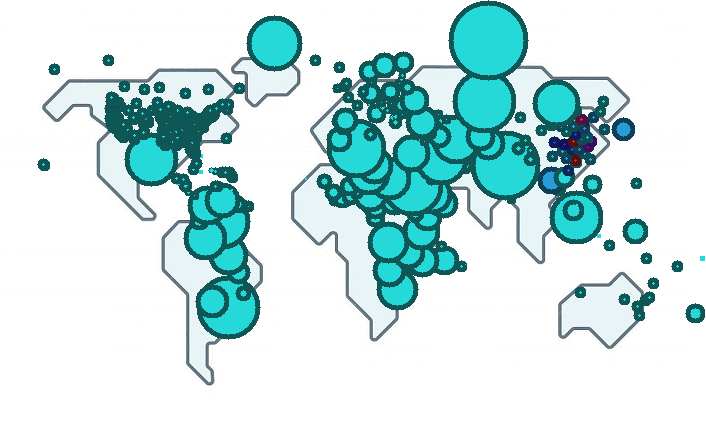

# CS225 FInal Project - Covid-19 Data Mapping and Visualization

#### Group members:
* Zhiheng Hua - hua13
* Weixuan Sun – weixuan6
* Zirui Wang - ziruiw3
* Zixuan Liu – zixuanl9

#### Mentor:
* Sahil Agrawal

## Introduction: 
- Our program uses data froms [COVID-19 2020 Jan-Mar Global](https://github.com/CSSEGISandData/COVID-19/tree/master/archived_data/archived_time_series) to find the risk level of COVID-19 across the globe and visualize the data onto world map. We use Shortest Path Algorithm (Dijkstra's algorithm) to find shortest path between two location and observe the covid data on the path, return a vector containing all nodes (countries) on the path. Finally, we project our data onto map for data visualization to generate separate confirmed, death and recovered level image as well as gif (to see the gradual change in risk level). 

## Building and Running:
The project can be built on most Windows, Mac and Linux Systems.
To download our program, please copy and paste this line to your terminal:

```
git clone https://github-dev.cs.illinois.edu/cs225-fa21/ziruiw3-weixuan6-hua13-zixuanl9.git
```

To build and run this project, you can use the included Makefile:
```make
make
./main
```
for the main program. Follow the code given to produce the output image or gif. Output images and gif animations for the global and regional COVID-19 data image for confirmed, death and recovered level will be in `./sample-output` folder. 

To test, move into the tests folder to build and run the included Makefile
```test
make test
./test
```
Notably, running `./test` may take a while when testing the entire data set simply due to large size of our dataset.

## Final Project Video:

Link: 

## Detail Description:

### Data Mapping to Covid Graph:
- relevant files:
    `Node.cpp`, `covidgraph.cpp`, `covidgraph-getter.cpp`, `dsets.cpp` (file developed by our MPs)

- You can view the sample CSV files located in data folder for reference. The first line of the CSV must be `Province/State, Country/Region, Lat, Long, 1/22/20, 1/23/20...` as attributes with following lines all containing corresponding data. Notice that some nodes may only have attribute `Country/Region`, we store each line as a Node, representing a specific country (or a state a country), and all nodes are stored in vectors of node pointers. Details construction and implementation about Node can be found in `Node.cpp`, `covidgraph.cpp` as well as `covidgraph-getter.cpp`.

### Data Visualization to Image and GIF:
- relevant files:
    `./cs225`, `visualization.cpp`, `Animation.cpp`, `Image.cpp`

After mapping our COVID-19 dataset to covidgraph, we intent to visualize our data on to the world map and store our results in format `.png` and `.gif`. All the output files will be stored in `sample-output` folder. 

Below is the example code to visualize the risk level of covid-19 in Oceania region. Through calling the function `getNodesByContinent(“OCENANIA”)`, we are able to get all nodes in the Oceania region. 
```
int main() {
//     CovidGraph g("data/countries-of-the-world.csv", "tests/ctest_data.csv", 
//                  "tests/dtest_data.csv", "tests/rtest_data.csv");

    CovidGraph g("data/countries-of-the-world.csv", "data/covid19-Confirmed.csv", 
                 "data/covid19-Deaths.csv", "data/covid19-Recovered.csv");

    Image baseImg;
    baseImg.readFromFile("data/world-map-small.png");
    Visualization visual(baseImg);

    /* Below are some sameple function calls */

    PNG png = visual.riskLevelPNG(g.getNodesByContinent("OCEANIA"));
    png.writeToFile("sample-output/oceania-risk-level.png");
    
    //PNG png1 = visual.riskLevelPNG(g.latNodes());
    //png1.writeToFile("sample-output/2020-world-risk-level.png");

    Animation gif = visual.confirmedGIF(g.latNodes(), "1/22", "3/23");
    gif.write("sample-output/2020-risk-level-animation.gif");

    return 0;
}
```

The resulting static image is written to file `sample-output/oceania-risk-level.png`, as shown below:

<p align="center">
  
</p>

Similarly, the result will export automatically in to the file `sample-output/2020-risk-level-animation.gif`, which is located in the `sample-output` folder.

<p align="center">
  
</p>

### Testing:
- We use the catch module from ./cs225 to create our own test suite. Our team have created three tests for the application, which are:
    1. ctest_data.csv
    2.	dtesst_data.csv
    3.	rtest_data.csv
- and three smaller test cases:
    1. mockc_data.csv
    2.	mockd_data.csv
    3.	mockr_data.csv
